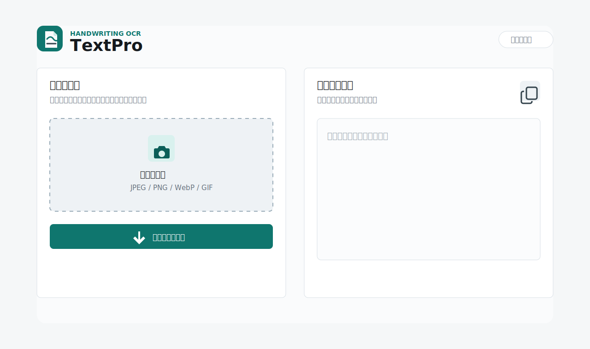
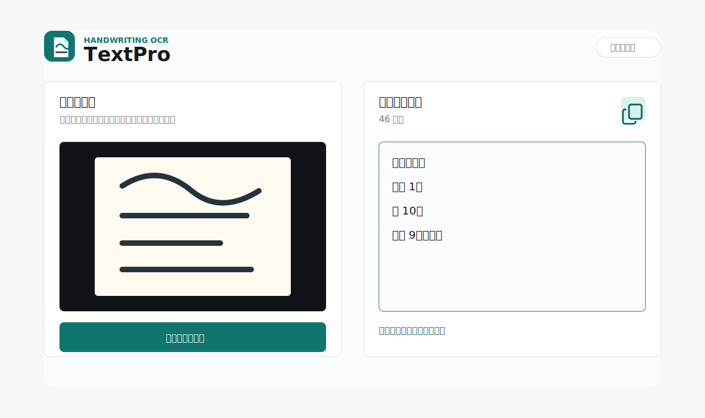

# TextPro

[](https://render.com/deploy?repo=https://github.com/Hibiki0417/TextPro)

手書き文字の写真をアップロードすると、OpenAI API で読み取り、コピーしやすいテキストに変換する Django アプリです。スマホのカメラからそのまま撮影して使えるように、画面はモバイル対応にしています。



## できること

- 手書きメモやノートの写真をアップロード
- OpenAI Responses API で画像を解析
- 読み取った文字をコピーしやすいテキストエリアに表示
- 読み取り結果をワンタップでコピー
- スマホ、タブレット、PC で使えるレスポンシブ UI



## 使い方

1. トップ画面で「写真を選択」を押します。
2. 手書きメモの写真を撮るか、保存済み画像を選びます。
3. 「テキスト化する」を押します。
4. 読み取り結果が表示されたら、コピーボタンでコピーします。

対応画像は JPEG、PNG、WebP、GIF です。画像はサーバーに保存せず、OpenAI API 呼び出しのためにメモリ上で Base64 data URL に変換します。

## 必要なもの

- Python 3.10 以上
- OpenAI API キー
- Windows PowerShell

## セットアップ

```powershell
cd C:\textpro
.\setup.ps1
```

セットアップ後、[.env](.env.example) を参考に `C:\textpro\.env` の `OPENAI_API_KEY` を設定してください。

```env
OPENAI_API_KEY=sk-your-api-key
OPENAI_MODEL=gpt-4.1-mini
```

## 起動

```powershell
cd C:\textpro
.\run.ps1
```

起動後、ブラウザで次の URL を開きます。

```text
http://127.0.0.1:8000/
```

同じ Wi-Fi のスマホから確認する場合は、PC の LAN IP を使って Django を `0.0.0.0:8000` で起動してください。

```powershell
.\.venv\Scripts\python.exe manage.py runserver 0.0.0.0:8000
```

## テスト

```powershell
.\.venv\Scripts\python.exe manage.py test
```

## 主な設定

| 変数 | 説明 | 例 |
| --- | --- | --- |
| `OPENAI_API_KEY` | OpenAI API キー | `sk-...` |
| `OPENAI_MODEL` | 画像読み取りに使うモデル | `gpt-4.1-mini` |
| `IMAGE_UPLOAD_MAX_BYTES` | アップロード画像の最大サイズ | `8388608` |
| `DJANGO_DEBUG` | Django のデバッグモード | `True` / `False` |
| `DJANGO_ALLOWED_HOSTS` | 許可するホスト名 | `127.0.0.1,localhost` |

## デプロイ

Render に載せやすいように [render.yaml](render.yaml)、[Procfile](Procfile)、[runtime.txt](runtime.txt) を用意しています。

すぐにデプロイする場合は、上の **Deploy to Render** ボタンを押してください。

Render で必要な環境変数:

- `OPENAI_API_KEY`
- `DJANGO_SECRET_KEY`
- `DJANGO_DEBUG=False`
- `DJANGO_ALLOWED_HOSTS`
- `DJANGO_CSRF_TRUSTED_ORIGINS`
- `OPENAI_MODEL=gpt-4.1-mini`

Render の Blueprint でこのリポジトリを指定すると、`render.yaml` の設定でビルドと起動ができます。

### Railway / Docker

[Dockerfile](Dockerfile) と [railway.json](railway.json) も用意しています。Railway では GitHub リポジトリを選択して、環境変数 `OPENAI_API_KEY` を設定すれば Dockerfile で起動できます。

Docker でローカル起動する場合:

```powershell
docker build -t textpro .
docker run --rm -p 8000:8000 --env-file .env textpro
```

## 構成

```text
textpro/
├─ ocr/                  # アップロード、画像検証、OpenAI 呼び出し
├─ static/ocr/           # CSS、JavaScript、ロゴ
├─ templates/ocr/        # 画面テンプレート
├─ textpro/              # Django プロジェクト設定
├─ docs/images/          # README 用の画面イメージ
├─ render.yaml           # Render デプロイ設定
├─ setup.ps1             # 初回セットアップ
└─ run.ps1               # ローカル起動
```

## 注意

- `.env` は `.gitignore` に入っているため、API キーは GitHub に上がりません。
- 実行環境に Python が無い場合、`setup.ps1` は失敗します。Python 3.10 以上をインストールしてから実行してください。
- 読み取り精度は写真の明るさ、ピント、文字の大きさに影響されます。

## OpenAI エラーが出るとき

アプリ画面に OpenAI のエラーが出る場合は、まず Render の Environment で次を確認してください。

- `OPENAI_API_KEY` が設定されている
- `OPENAI_API_KEY` に余分な空白や改行が入っていない
- OpenAI 側で API 利用上限や課金設定に問題がない
- `OPENAI_MODEL` が利用可能な画像対応モデルになっている

デフォルトは `gpt-4.1-mini` です。モデル権限エラーが出る場合は、Render の `OPENAI_MODEL` を利用可能な画像対応モデルに変更してください。

`OpenAI API の利用上限に達しています` と出る場合は、OpenAI Platform の Billing / Usage / Limits を確認してください。ChatGPT Plus などの契約と OpenAI API の課金枠は別扱いです。
